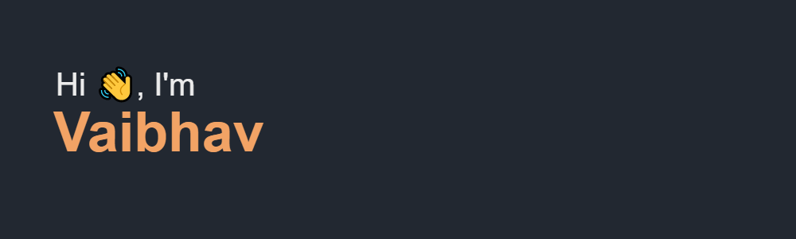

<!--
**GhostVaibhav/GhostVaibhav** is a ✨ _special_ ✨ repository because its `README.md` (this file) appears on your GitHub profile.

Here are some ideas to get you started:

- 🔭 I’m currently working on ...
- 🌱 I’m currently learning ...
- 👯 I’m looking to collaborate on ...
- 🤔 I’m looking for help with ...
- 💬 Ask me about ...
- 📫 How to reach me: ...
- 😄 Pronouns: ...
- ⚡ Fun fact: ...
-->
<header>

</header>

## :wink: About Me
Hi :wave:, my name is Vaibhav and I am an undergraduate student 👨🏻‍🎓 at Vellore Institute of Technology, Vellore 🏫 currently pursuing my Bachelors in Computer Science:nerd_face:.
 

## 👨🏻‍💻 Languages that I usually code in:
<b><li>C/C++</b> - Quite good in this, do most of my coding in this only<b><li>Python</b> - Beginner but able to handle basic tasks<b><li>HTML</b> - Beginner but able to make something very quickly <b><li>CSS</b> - Same goes for it as well
 

## 🌱 What am I learning currently?
Well nothing out of the world, but trying my hands to learn various APIs, libraries, and how they work. Also, I learned about documenting my projects.
 

## :dart: What am I currently working on?
I am currently working on a game, basically "Chess" with SFML and C++. <b>Seems easy</b> but hard to code
 

## 📫 How to reach me?

Reach me out on  [LinkedIn][2]. I will be more than happy to connect with you!
You can also <a href="mailto:sharmavaibhav110028@gmail.com">mail</a> me!
<be>

[2]: https://www.linkedin.com/in/ghost-vaibhav/
